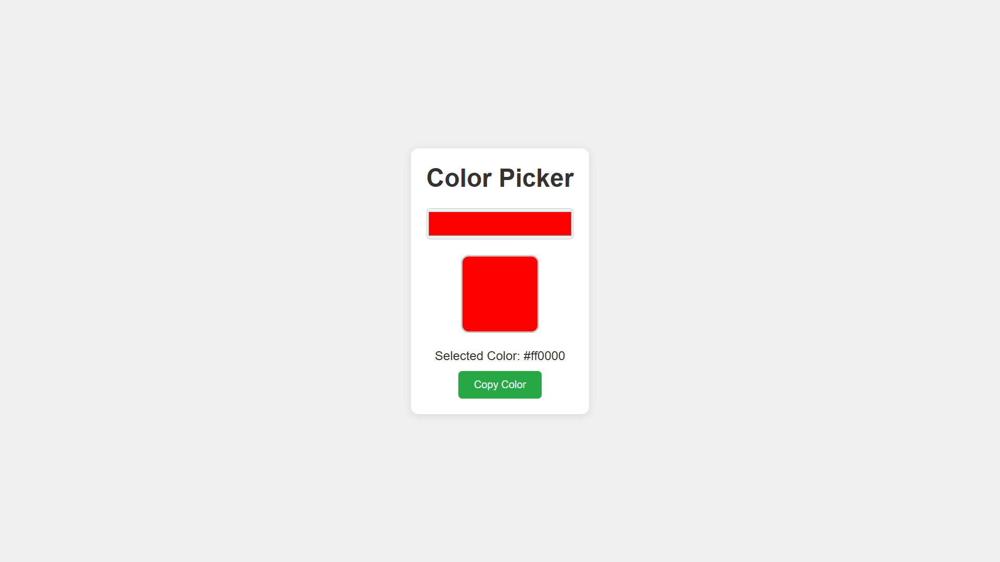

# Color Picker

> A simple and modern color picker web app built with HTML, CSS, and JavaScript.

## Features

- **Live Color Preview:** Instantly see the selected color in a display box.
- **Hex Color Value:** Shows the hex code of the selected color.
- **Copy to Clipboard:** Easily copy the selected color code with a button click.
- **Responsive Design:** Works well on both desktop and mobile devices.

# Live Demo
 [Click here to view the project](https://sumitsharmawb.github.io/06_Color-Picker/)

## Preview
<!-- Add a screenshot if available -->

## How to Use

1. Open `index.html` in your browser.
2. Use the color input to pick any color you like.
3. The selected color will be shown in the display box and its hex code will appear below.
4. Click the **Copy Color** button to copy the hex code to your clipboard.

## Project Structure

- `index.html` – Main HTML file
- `style.css` – Styles for the app
- `script.js` – JavaScript logic for color picking and copying

## Credits

Made by Sumit.

---

Feel free to use, modify, and share!
